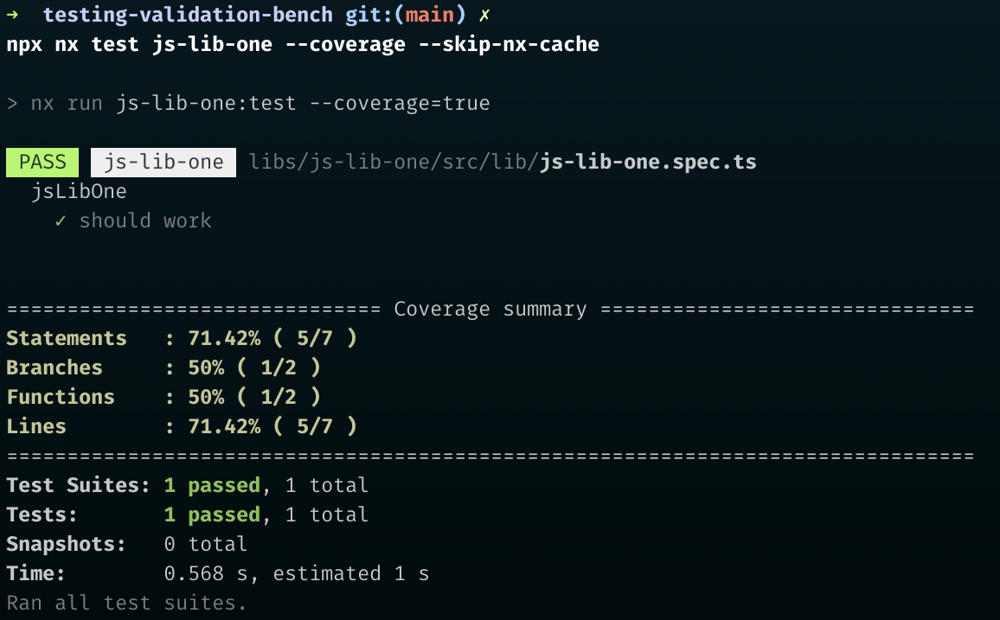
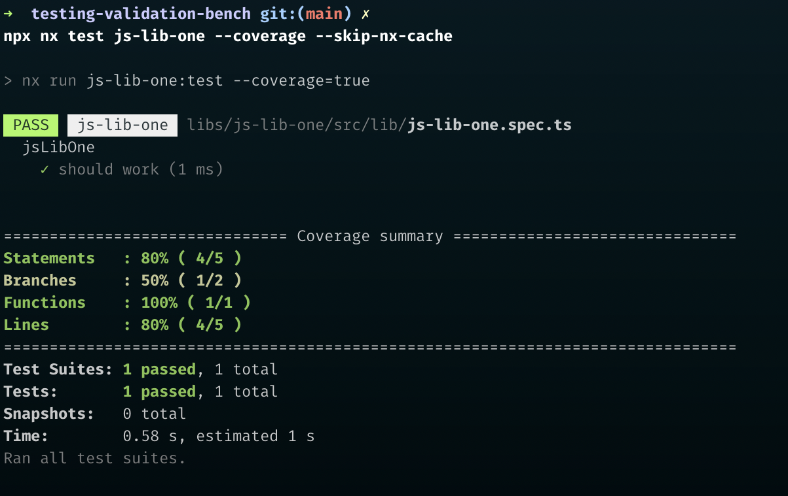

# TVB

Testing Validation Bench for nx testing plugins

This project is aimed at providing examples on how to use common libraries with @nrwl/jest & @nrwl/cypress and will be used for validating changes within those plugin to catch any potential issues.

## How to use

`npm run validate` to run all the tests in the library without any cache

> Note: [hyperfine](https://github.com/sharkdp/hyperfine) is required for benchmarks.
> They don't really do much right now other than just run. future work will go into this to make sure @nrwl/jest and @nrwl/cypress are performant

`npm run benchmark` to run a benchmark of various different parameters for the test

## Common Usage Help

### [Nano Id](https://github.com/ai/nanoid)

add nanoid to the transformIgnorePatterns patterns.
react (babel-jest) also requires adding a preset to the root babel.config.json file or the babel-jest transformer options.

- [angular jest config](apps/ng-app-one/jest.config.ts)
- [react jest config](apps/react-app-one/jest.config.ts)

```ts
// project level jest.config.ts using babel-jest as a transformer

'^.+\\.[tj]sx?$': ['babel-jest', { presets: ['@nrwl/next/babel'] }],
```

```json
// babel.config.json (root of workspace)
{
  "babelrcRoots": ["*"],
  "presets": [
    [
      "@nrwl/react/babel",
      {
        "runtime": "automatic"
      }
    ]
  ]
}
```

### UUID (https://github.com/uuidjs/uuid)

should just work with the default jest configs

### Firebase (https://github.com/firebase/firebase-js-sdk)

should just work with the default jest configs

if not, make sure your root preset contains (which is included in the @nrwl/jest/preset)

```js
module.exports = {
  // other stuff most likely nxPreset from @nrwl/jest/preset
  testEnvironmentOptions: {
    customExportConditions: ['node', 'require', 'default'],
  },
};
```

### d3 (https://github.com/d3/d3)

use a moduleNameMapper to point to the d3.min.js version instead of transpiling.
this can be in the root jest.preset.js or in the require projects jest.config.ts
[see jest.preset.js](jest.preset.js)

```js
// root jest.preset.js
const nxPreset = require('@nrwl/jest/preset').default;

module.exports = {
  ...nxPreset,
  moduleNameMapper: {
    '^d3$': 'node_modules/d3/dist/d3.min.js',
  },
};
```

### Okta (https://github.com/okta/okta-auth-js)

Okta's login widget relies on the canvas api, you can mock this with the [jest-canvas-mock package](https://www.npmjs.com/package/jest-canvas-mock). You can add this to the `setupFilesAfterEnv` array.

```ts
// project level jest.config.ts
export default {
  // ... other config options
  setupFilesAfterEnv: ['<rootDir>/src/test-setup.ts', 'jest-canvas-mock'],
};
```

### Circular Reference JSON error from zone.js

this is probably another error from within zone.js that jest cannot unwrap to display in the terminal.
I've had luck returning the problematic tests via my editor (webstorm) and getting the actual error.

example error from jest

```shell
TypeError: Converting circular structure to JSON
  starting at object with constructor 'Zone
  property '_zoneDelegate' object with constructor ' _ZoneDelegate'
  property 'zone' closes the circle
    at stringify (<anonymous>)
    at messageParent (.. /../.. /node_modules/jest-worker/build/workers/messageParent.js:34:19)
```

the root issue was from a missing global API

```shell
Error: Uncaught (in promise): ReferenceError: FontFace is not defined
 ReferenceError: FontFace is not defined
```

patching the global FontFace fixed it in this case.

### @testing-library/jest-dom

1. install `@testing-library/jest-dom` and `@types/testing-library__jest-dom`
2. add `@testing-library/jest-dom` types to your projects `tsconfig.spec.json`
3. create a set up file such as `setup-jest-dom.js` next to your projects `jest.config.ts`.

- or add to an existing setup file you already have such as test-setup.ts include in ng projects

4. import (or require) `'@testing-library/jest-dom'` in your setup file.
5. include the file in the `setupFilesAfterEnv` array `setupFilesAfterEnv: ['<rootDir>/setup-jest-dom.js']`

If you wish to have testing-library/jest-dom globally avaiable then add the setupFilesAfterEnv option to your root jest.preset.js and resolve it's path via `path.resolve(__dirname, '<path to setup file>'),`

See this repos [root jest.preset.js](jest.preset.js) for an example

### globally use coveragePathIgnorePatterns

Set up the patterns in the [root jest.preset.js](jest.preset.js)

You can comment/uncomment the coverage pattern in the root jest.preset.js and run `npx nx test js-lib-one --skip-nx-cache` to see it working.

```js
const nxPreset = require('@nrwl/jest/preset').default;

module.exports = {
  ...nxPreset,
  coveragePathIgnorePatterns: ['no-coverage.ts'],
};
```





### Cypress env vars

> [Cypress docs on env vars](https://docs.cypress.io/guides/guides/environment-variables)

there are multiple ways to use env vars with cypress

1. cli arguments `--env.SOME_API_KEY=<value>`
2. [cypress.env.json](https://docs.cypress.io/guides/guides/environment-variables#Option-2-cypress-env-json)
3. [env executor option](https://nx.dev/packages/cypress/executors/cypress#env)
4. [.env file](https://nx.dev/guides/environment-variables#environment-variables)

> I would recommend using cypress.env.json or the executor options.

When using cli arguments, this will override any env executor options set in your projects config file.

.env file requires a `CYPRESS_` prefix to be picked up by cypress

You can see examples of these via the [ng-app-one-e2e](apps/ng-app-one-e2e) or [react-app-one-e2e](apps/react-app-one-e2e) projects.

## TODO

### Jest

- [ ] add code examples for Okta
- [ ] mock lib imports in app (https://github.com/nrwl/nx/issues/10029)
- [ ] Merge code coverage reports together (https://github.com/nrwl/nx/issues/10423)
- Libraries to add to the list:
  - [KY](https://www.npmjs.com/package/ky)
  - [react-dnd](https://github.com/react-dnd/react-dnd)

### Cypress

- [ ] static service FE app
- [ ] in depth component tests (ref: https://github.com/nrwl/nx/issues/11372)
